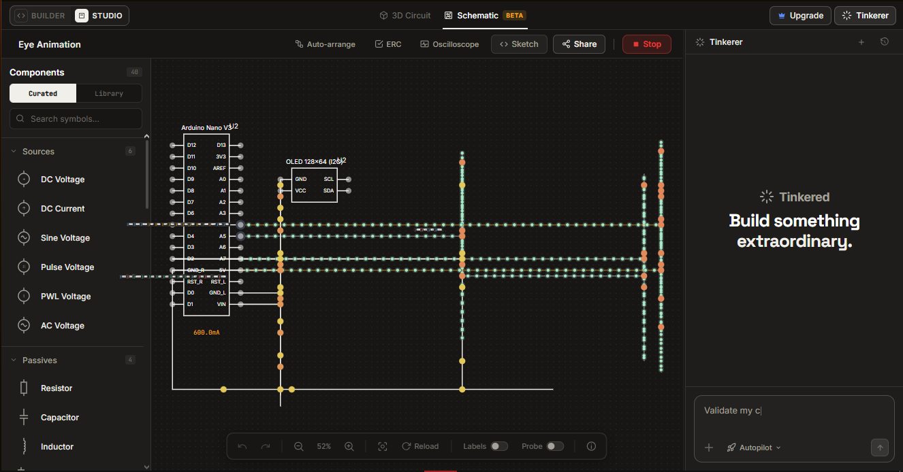

# Eye Animation Arduino

Saya membuat proyek **Arduino Eye Animation** menggunakan Arduino/ESP32 dan OLED display. Kode dalam proyek ini sebagian saya dapatkan dari bantuan AI dan tutorial di YouTube.

Jika ingin mengambil atau menggunakan kodenya, kamu bisa menemukannya di folder **`wiring`**. :)

## 🔧 Komponen yang Dibutuhkan

1. Arduino atau ESP32 (versi apa saja).
2. 4 kabel jumper.
3. OLED screen.
4. Breadboard.

## 🔌 Circuit

Berikut adalah bentuk rangkaian circuit dari proyek ini:

<<<<<<< HEAD

=======

>>>>>>> 0933eba35cd38c99c0da9e8a2b4bd6e46d8947c7

## 📐 Schematic

Berikut adalah schematic circuit-nya:

<<<<<<< HEAD

=======

>>>>>>> 0933eba35cd38c99c0da9e8a2b4bd6e46d8947c7

## 🖥️ Simulasi

Untuk melakukan simulasi, saya menggunakan beberapa platform:

* [Tinkercad](https://www.tinkercad.com/)
* [Wokwi](https://wokwi.com/)
* [Tinkered.AI](https://tinkered.ai)

Semoga proyek ini berhasil dan bermanfaat!
**Selamat mencoba! 🚀**
